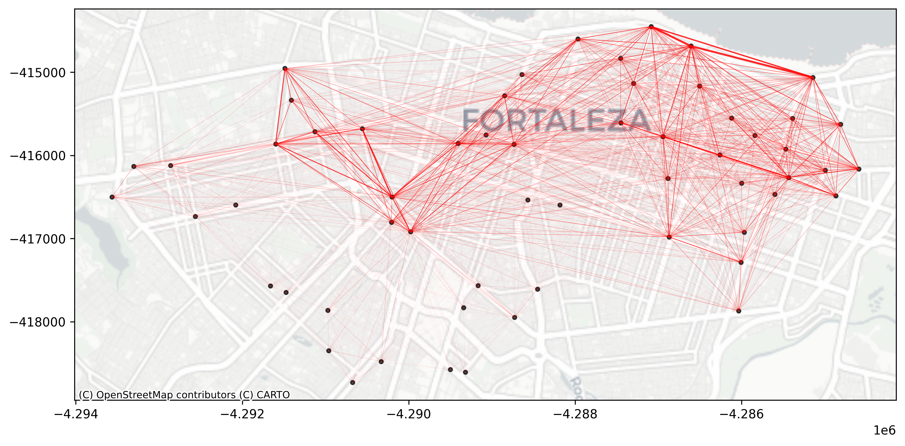

# Connectivity Graphs of Fortaleza's Bike Sharing System

This repository contains Python code and visualizations that explore the connectivity of Fortaleza's bike sharing system in Northeast Brazil. The connectivity graphs were generated using real operational data from the system, spanning the years **2014 to 2024**.

## 📂 Contents

- `connectivity_graphs.py`: Python script to generate connectivity graphs from station data.
- `2014.png` to `2024.png`: Annual connectivity graphs showing station interactions and network structure.
- `README.md`: Project overview and usage instructions.

## 📊 Description

The connectivity graphs illustrate how bike stations are linked based on user trips. Each node represents a station, and each edge represents a connection based on trips between stations. These visualizations help identify:

- Central hubs in the network
- Temporal changes in connectivity
- Potential gaps or bottlenecks in the system

## 🛠️ Requirements

To run the Python script, make sure you have the following libraries installed:

```bash
pip install pandas geopandas matplotlib geometry contextily os

## 🌍 Data Source

The data used to generate these graphs comes from the official bike sharing system of **Fortaleza, Ceará, Brazil**, covering the period from **2014 to 2024**.

## 🤝 Contributing

Feel free to fork the repository, submit issues, or open pull requests to improve the code or visualizations.

## 📸 Connectivity Graphs by Year

Below are the annual connectivity graphs generated from Fortaleza's bike sharing system data:

### 2014


### 2015


### 2016


### 2017


### 2018


### 2019


### 2020


### 2021


### 2022


### 2023

